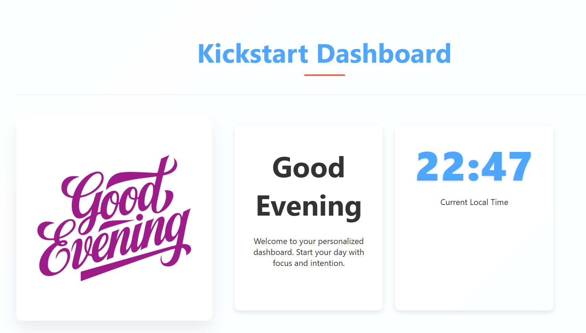

# Kickstart Dashboard: Your Day in Focus - A React Assignment for Steven


This is my submission for the Good Morning Page assignment using React JS. The goal was to create a visually appealing and user-friendly dashboard that displays a personalized greeting and the current time.

## Screenshot

Here's a snapshot of the dashboard:



## Project Structure

The project is structured as a standard React application:

```
good-morning-page
├── public
│   ├── index.html          # Main HTML file
│   ├── manifest.json       # Metadata for PWA features
│   └── robots.txt          # Instructions for web crawlers
├── src
│   ├── components          # React components
│   │   ├── GoodMorningCard.jsx  # Displays greeting message
│   │   ├── Header.jsx      # Displays the page header
│   │   └── TimeDisplay.jsx  # Shows current time
│   ├── styles              # CSS styles
│   │   ├── App.css         # Styles for the main app component
│   │   └── index.css       # Global styles
│   ├── assets              # Static assets
│   │   ├── morning-background.png  # Background image for morning
│   │   ├── afternoon-background.png # Background image for afternoon
│   │   └── evening-background.png   # Background image for evening
│   ├── App.jsx             # Main application component
│   ├── index.jsx           # Entry point for the React app
│   └── utils             # Utility functions
│       └── timeUtils.js    # Time formatting and image selection
├── package.json            # npm configuration file
├── README.md               # Project documentation (this file!)
└── .gitignore              # Git ignore file
```

## Key Features

- **Personalized Greeting**: Displays "Good Morning", "Good Afternoon", or "Good Evening" based on the current time.
- **Real-Time Clock**: Shows the current time, updated dynamically.
- **Dynamic Background**: Changes the background image to match the time of day.
- **Responsive Design**: Adapts to different screen sizes for optimal viewing on various devices.
- **Clean UI**: A simple and modern user interface for a pleasant user experience.

## Technologies Used

- React JS
- CSS
- JavaScript

## How to Run

To run this project locally:

1.  Clone the repository:

    ```bash
    git clone <repository-url>
    ```
2.  Navigate to the project directory:

    ```bash
    cd good-morning-page
    ```
3.  Install the dependencies:

    ```bash
    npm install
    ```
4.  Start the development server:

    ```bash
    npm start
    ```
5.  Open your browser and go to `http://localhost:3000`.

## Notes

This project was created as part of the React JS assignment. I focused on creating a clean, functional, and visually appealing dashboard.

Thanks,
Steven
